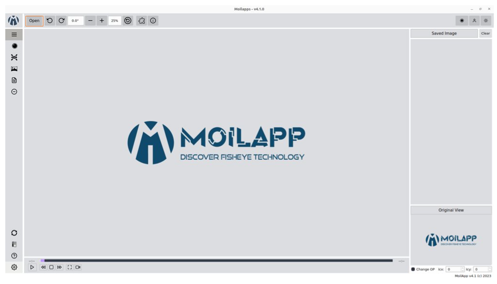

TEST DOCUMENTATION
==================

.. _installation:

Instalataion
------------

this is how to install

.. code-block:: console

    (.venv) $ pip install test

Autodock
-----------

.. automodule:: test
    :members:
    :undoc-members:
    :show-inheritance:

    testing

